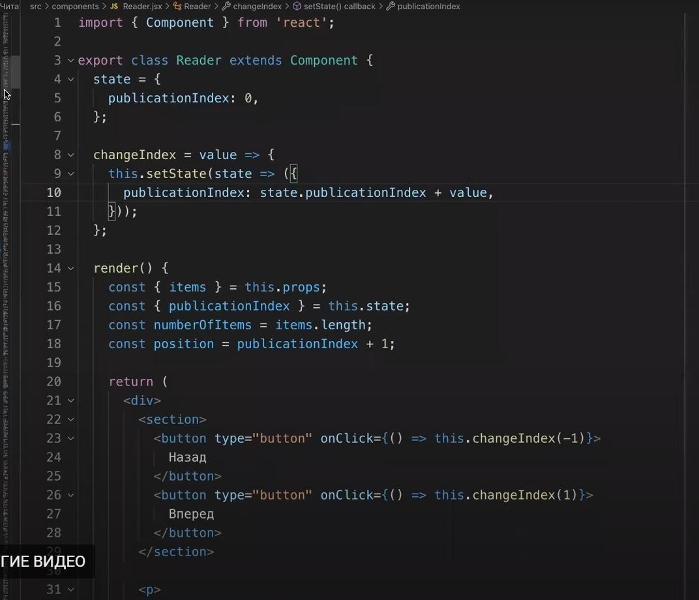

1. если в интефейсе есть кнопки, которые увеличивают или уменьшают на 1 какое-то
   значение, то можно не делать для каждой кнопки отдельную функцию, а для
   кнопок сделать onClick ={()=> this.функция(+1 или -1)}

   
